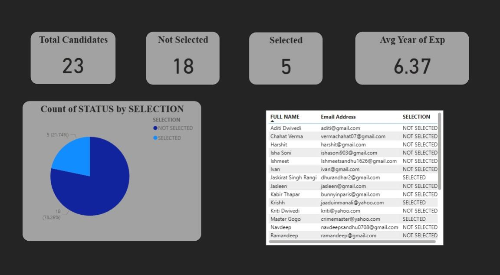

# 📊 AI-Based Candidate Screening & HR Automation (n8n)

## 🚀 Overview
This project is an automated HR recruitment workflow built using n8n. It streamlines candidate screening by integrating Google Sheets, conditional logic, automated emails, and a visual dashboard.

The system automatically:
- Captures candidate data
- Filters candidates (Selected / Not Selected)
- Sends automated email responses
- Updates records in Google Sheets
- Displays insights in a dashboard

---

## 🧠 Workflow Architecture

Google Sheets Trigger → IF Node  
        │  
        ├── Selected → Update Sheet → Send Email  
        │  
        └── Not Selected → Update Sheet  

---

## 🛠️ Technologies Used

- n8n (Workflow Automation)  
- Google Sheets (Data Storage)  
- SMTP / Gmail API (Email Automation)  
- HTML, CSS, JavaScript (Dashboard)  
- Chart.js (Data Visualization)  
- GitHub (Version Control)  

---

## 📸 Screenshots

### n8n Workflow
![n8n pipleline.jpeg)

### Dashboard

---

## ⚙️ Setup Instructions

### 1. Clone Repository
git clone https://github.com/your-username/your-repo-name.git  
cd your-repo-name  

---

### 2. Setup n8n Workflow
- Open n8n  
- Import the workflow JSON file  
- Connect your credentials:
  - Google Sheets  
  - Email (SMTP/Gmail)  

---

### 3. Configure Google Sheet
Ensure your sheet has columns:
- Full Name  
- Email  
- Experience  
- Status  

---

### 4. Run Workflow
- Click "Execute Workflow" in n8n  
- Add a new row in Google Sheets  
- Workflow will run automatically  

---

## 📊 Dashboard Features

- Total Candidates Count  
- Selected vs Not Selected  
- Average Experience  
- Candidate Table  
- Pie Chart Visualization  

---

## 💼 Use Case in HR

This system helps HR teams to:
- Automate candidate screening  
- Reduce manual work  
- Send instant responses  
- Track hiring data visually  
- Improve decision-making  

---

## 🌟 Future Enhancements

- AI-based resume screening  
- Predictive hiring analytics  
- Chatbot for candidate interaction  
- Integration with ATS systems  
- Live dashboard with APIs  

---

## 🚀 Benefits

- Faster hiring process  
- Reduced human bias  
- Scalable recruitment  
- Data-driven decisions  
- Better candidate experience  

---

## 📁 Project Structure

├── workflow/           # n8n workflow JSON  
├── dashboard/          # Frontend dashboard code  
├── assets/             # Screenshots  
└── README.md  

---

## 👩‍💻 Author

Isha Soni  

---

## ⭐ Support

If you like this project:
- Star the repo  
- Fork it  
- Share it
